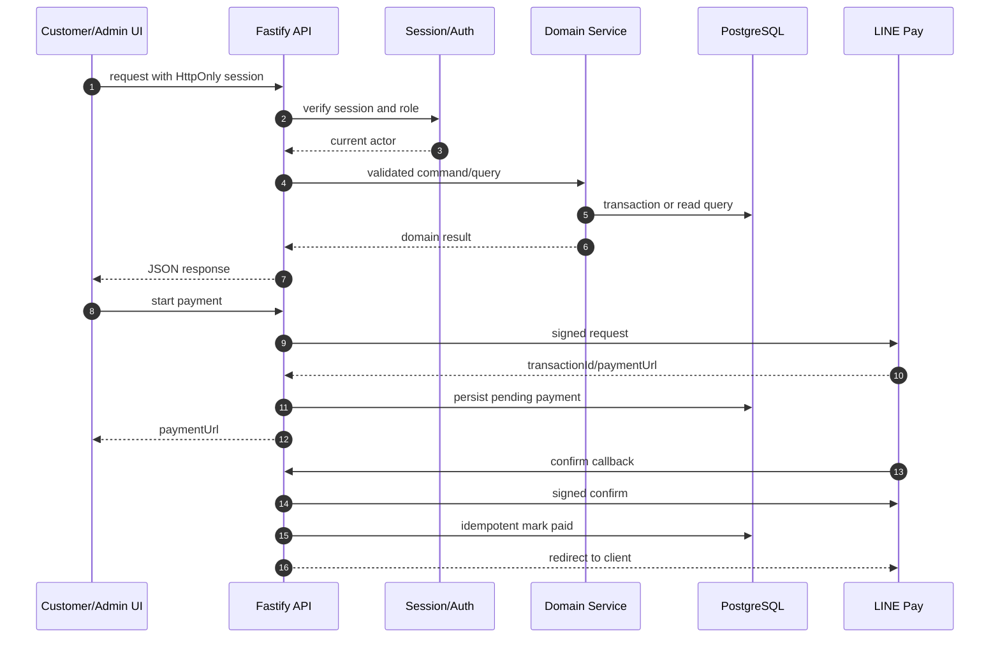

# Mini Shop Architecture

## 1. Architectural direction

Mini Shop ใช้ **modular monolith** เป็นสถาปัตยกรรมหลักในระยะนี้ Backend เป็น process เดียวที่แบ่ง business capability ด้วย modules/repositories ไม่แยก microservices ก่อนมี operational need จริง เหตุผลคือ order, stock และ payment ต้องใช้ transaction และ state transition ที่ประสานกัน การแยก service เร็วเกินไปจะเพิ่ม distributed consistency และ deployment complexity

## 2. Current state

```text
React + Vite client
        |
        | REST/JSON + HttpOnly cookie
        v
Fastify + TypeScript server
        |
        +-- auth service / LINE ID token verification
        +-- product repository
        +-- order service/repository
        +-- payment service + LINE Pay adapter
        +-- admin routes
        v
PostgreSQL via Drizzle ORM
```

Current implementation uses REST endpoints in `server/src/app.ts`, repository implementations in `server/src/{users,products,orders}`, and tests in `server/tests`. tRPC exists as a foundation router but is not the primary contract for current feature routes.

## 3. Target boundaries

เมื่อ code เติบโต ให้ย้ายจาก route-heavy `app.ts` ไปเป็น module routers โดยคง public contracts ใน `API.md`

```text
server/src/
  core/                 env, errors, request context, authorization
  auth/                 LINE verification and sessions
  catalog/              products, categories, stock reads
  orders/               order service, state machine, repository
  payments/             payment service and provider adapters
  admin/                dashboard queries and commands
  notifications/        LINE or other provider adapters
  jobs/                 reservation expiry and reconciliation workers
  db/                   schema, client, migrations
```

การย้ายไฟล์ต้องเป็น refactor ที่ไม่เปลี่ยน API โดยไม่จำเป็น และควรทำผ่าน issue แยกจาก feature ใหม่

## 4. Request flow



## 5. State ownership

- **Auth session:** backend signs and verifies; client only sends cookie.
- **Product price and stock:** PostgreSQL is authoritative.
- **Cart:** browser state is provisional and never authoritative for price.
- **Order totals/items:** server creates immutable item price/name snapshots.
- **Payment:** provider transaction ID plus database payment fields; confirm must be idempotent.
- **Fulfillment status:** staff/admin command, not payment callback.

## 6. Authorization model

`customer` อ่าน catalog และจัดการ order ของตนเอง `staff`, `manager` และ `owner` ใช้ admin dashboard ตาม scope ที่ระบุใน API contract ระยะถัดไปควรแยก permission จาก role เช่น `orders:read`, `orders:update`, `inventory:adjust`, `catalog:write` เพื่อรองรับ least privilege

## 7. Reliability requirements

Order creation และ reservation ต้องเป็น transaction เดียว Payment request/confirm ต้องรองรับ retry โดยไม่สร้างผลซ้ำ การปรับ stock ต้องมี database predicate ป้องกันค่าต่ำกว่า reserved การทำงานภายนอก เช่น notification, reservation expiry และ reconciliation ไม่ควรบล็อก request หลักเมื่อย้ายไป worker ในอนาคต

## 8. Deployment topology

เริ่มต้น deploy frontend และ API แยกกันได้ โดย API ต้องมี public HTTPS สำหรับ payment callback และเชื่อม managed PostgreSQL การ deploy ต้อง apply migrations เป็นขั้นตอนที่ตรวจสอบได้ มี health endpoint และแยก environment development, sandbox และ production อย่างชัดเจน

## 9. Architectural risks

ความเสี่ยงสำคัญคือ route และ domain logic รวมอยู่ใน `app.ts`, ยังไม่มี reservation expiry worker, payment reconciliation และ audit event table, รวมถึง architecture document เดิมกล่าวถึงโมดูลที่ยังไม่ถูกสร้างจริง ดังนั้นเอกสารฉบับนี้แยก current/target เพื่อไม่ให้ผู้พัฒนาคิดว่าส่วน target พร้อมใช้งานแล้ว
