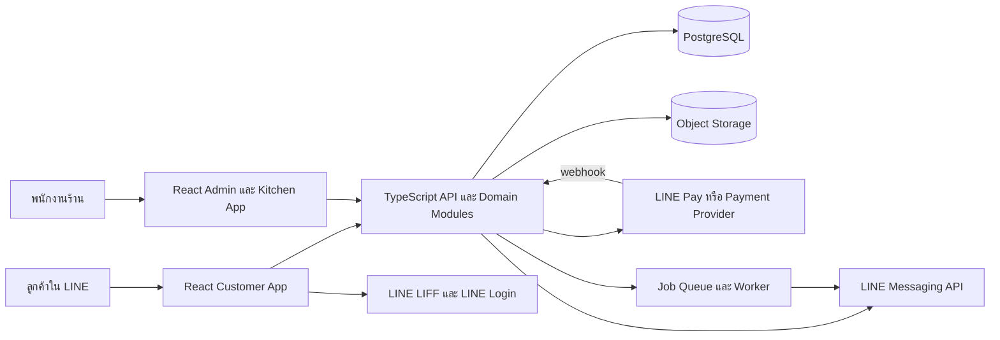
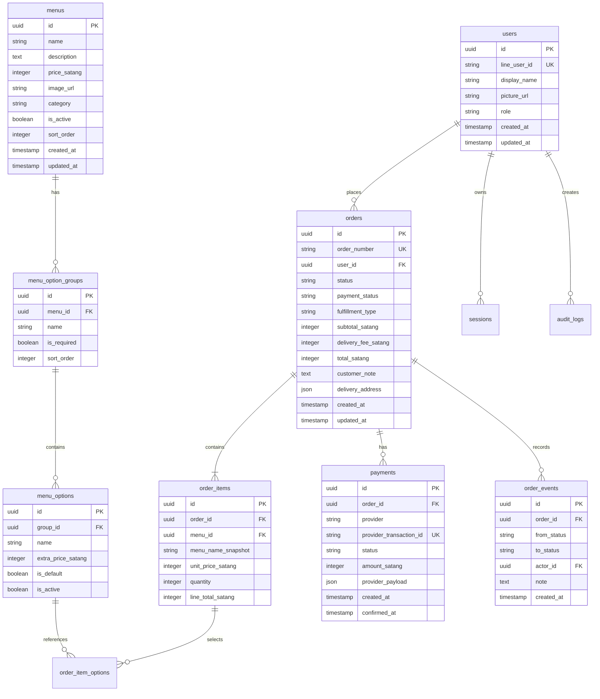
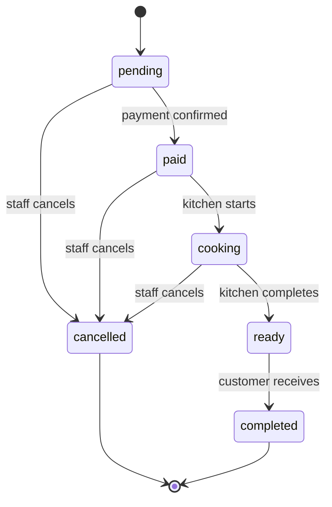

# Mini Shop Modern System Architecture

## เป้าหมาย

เอกสารนี้กำหนดสถาปัตยกรรมสำหรับย้าย Mini Shop จากเว็บ HTML/JavaScript และ Google Apps Script/Google Sheets ไปเป็นระบบใหม่ที่ใช้ React และ backend สมัยใหม่ โดยยังคงฟีเจอร์หลักเดิม ได้แก่ การดูเมนู การเลือกตัวเลือกอาหาร ตะกร้าสินค้า การสั่งซื้อ การชำระเงิน การติดตามสถานะ ระบบหลังบ้าน และจอครัว

แนวทางหลักคือ **เริ่มด้วย modular monolith** แทนการแยกเป็น microservices ตั้งแต่แรก ระบบจะมี backend เดียวที่แบ่งขอบเขตภายในชัดเจน จึงพัฒนาและ deploy ได้ง่าย ขณะเดียวกันสามารถแยกบางโมดูลออกเป็น service ภายหลังได้หากปริมาณงานเพิ่มขึ้น

## ข้อเสนอแนะโดยสรุป

| ส่วน | เทคโนโลยีที่เลือก | เหตุผล |
|---|---|---|
| Customer frontend | React 19, TypeScript, Vite, React Router | เหมาะกับ LINE LIFF และประสบการณ์แบบ mobile-first |
| Admin/Kitchen frontend | React ชุดเดียวกับ customer app แยก route และ layout | ใช้ component และ type ร่วมกัน ลดโค้ดซ้ำ |
| API | Node.js, TypeScript, Express หรือ Fastify, tRPC | ได้ type-safe contract ระหว่าง frontend และ backend |
| Validation | Zod | ใช้ schema เดียวตรวจทั้ง request และ domain input |
| Database | PostgreSQL | รองรับ relational data, transaction, constraint และ query ที่เชื่อถือได้ |
| ORM | Drizzle ORM | schema อยู่ใน TypeScript และ migration ตรวจสอบใน Git ได้ |
| Authentication | LINE LIFF/LINE Login สำหรับลูกค้า, session/OAuth สำหรับ staff | แยก identity ของลูกค้าออกจากสิทธิ์หลังบ้านอย่างชัดเจน |
| File storage | S3-compatible object storage | เก็บรูปเมนูโดยไม่ผูกกับ repository หรือ database |
| Payment | Payment adapter สำหรับ LINE Pay พร้อม webhook | ป้องกันการผูก business logic กับ provider รายเดียว |
| Background work | Database-backed job queue หรือ Redis queue เมื่อจำเป็น | ส่ง notification และ retry งานภายนอกโดยไม่บล็อกการสั่งซื้อ |
| Deployment | Frontend และ API deploy แยกได้ แต่เริ่มจาก monorepo เดียว | ให้ deploy ง่ายและรองรับการ scale แยกภายหลัง |

## ภาพรวมระบบ



## ขอบเขตของแอปพลิเคชัน

ระบบใหม่ควรมี frontend ชุดเดียว แต่แบ่ง route เป็นสามพื้นที่เพื่อรักษา user experience และสิทธิ์การใช้งานให้ชัดเจน

### Customer app

พื้นที่นี้เปิดจาก LINE LIFF และออกแบบ mobile-first ประกอบด้วยหน้า home, menu, cart, checkout และ order status ลูกค้าสามารถใช้งานแบบ guest ได้เฉพาะส่วนที่อนุญาต แต่การสร้างออเดอร์ควรผูกกับ LINE user identity เพื่อป้องกันการติดตามออเดอร์ของผู้อื่น

### Admin app

พื้นที่นี้ใช้สำหรับจัดการเมนู ออเดอร์ รายงาน และพนักงาน ควรใช้ dashboard layout ที่มี sidebar และกำหนดสิทธิ์ตาม role เช่น owner, manager และ staff การเข้าสู่ระบบของ admin ไม่ควรใช้ shared key ที่ฝังใน browser

### Kitchen app

พื้นที่นี้เป็นหน้าจอเฉพาะสำหรับดูออเดอร์ที่ต้องทำ เปลี่ยนสถานะ และดูเวลาที่ออเดอร์ค้าง ระบบควรมี polling ที่กำหนดช่วงเวลา หรือใช้ Server-Sent Events/WebSocket ในภายหลังเมื่อจำเป็น

## โครงสร้าง backend

Backend เป็น modular monolith ที่แบ่งตาม business capability ไม่แบ่งเพียงตามชนิดไฟล์ แต่ละโมดูลควรประกอบด้วย router, validation, service และ repository ของตนเอง ส่วนที่เกี่ยวข้องกับ payment และ notification ต้องเรียกผ่าน interface เพื่อเปลี่ยน provider ได้โดยไม่กระทบ order domain

```text
server/
  _core/
    context.ts             # request context, session, current actor
    env.ts                 # validated environment variables
    errors.ts              # typed application errors
    observability.ts       # structured logs and request tracing
  db/
    client.ts              # database connection
    schema.ts              # Drizzle schema
    migrations/
  modules/
    auth/
      router.ts
      service.ts
      schemas.ts
    catalog/
      router.ts
      service.ts
      repository.ts
      schemas.ts
    cart/
      service.ts
      schemas.ts
    orders/
      router.ts
      service.ts
      repository.ts
      state-machine.ts
      schemas.ts
    payments/
      router.ts
      service.ts
      providers/
        linepay.ts
        payment-provider.ts
      schemas.ts
    notifications/
      service.ts
      providers/
        line.ts
        notification-provider.ts
    admin/
      router.ts
      service.ts
      permissions.ts
    reports/
      router.ts
      service.ts
  jobs/
    worker.ts
    notification-jobs.ts
  routers.ts               # tRPC router composition
```

### API contract

ใช้ tRPC เป็น internal API contract สำหรับ React app เพราะ backend และ frontend อยู่ใน TypeScript monorepo เดียวกัน ทำให้ type ของ input, output และ error ไหลต่อเนื่องโดยไม่ต้องสร้าง REST client ซ้ำหลายชุด หากมี third-party integration ในอนาคตให้เพิ่ม REST webhook endpoint ที่มี schema ตรวจด้วย Zod โดยตรง

ตัวอย่าง procedure ที่ควรมี:

| Procedure | สิทธิ์ | หน้าที่ |
|---|---|---|
| `catalog.list` | public | แสดงเมนู active และ option groups |
| `catalog.get` | public | แสดงรายละเอียดเมนูหนึ่งรายการ |
| `orders.create` | customer | สร้างออเดอร์และคำนวณราคาฝั่ง server |
| `orders.getMine` | customer | ดูออเดอร์ของผู้ใช้ปัจจุบัน |
| `orders.getById` | customer/staff | ดูออเดอร์ตามสิทธิ์ |
| `orders.updateStatus` | staff | เปลี่ยนสถานะตาม state machine |
| `payments.createCheckout` | customer | สร้าง payment session |
| `payments.webhook` | provider | รับผลการชำระเงินและตรวจ signature |
| `admin.menu.update` | manager/owner | แก้ไขเมนูและสถานะขาย |
| `reports.daily` | manager/owner | ดูรายงานยอดขายรายวัน |

## การออกแบบฐานข้อมูล

ฐานข้อมูลใหม่ควรเก็บข้อมูลเชิงธุรกิจใน PostgreSQL แทน Google Sheets เพื่อให้รองรับ transaction, unique constraint และ query ที่เชื่อถือได้ โครงสร้างหลักมีดังนี้



### หลักการสำคัญของข้อมูล

ราคาทั้งหมดควรเก็บเป็นจำนวนเต็มหน่วยสตางค์ เช่น `6000` แทน `60.00` เพื่อหลีกเลี่ยง floating-point error ทุก order item ต้องเก็บ snapshot ของชื่อและราคาสินค้าในเวลาที่สั่ง เพราะเมนูอาจถูกแก้ไขภายหลัง

การสร้างออเดอร์ต้องอยู่ใน database transaction เดียว โดยตรวจเมนูและ option จากฐานข้อมูล คำนวณยอดใหม่ฝั่ง server สร้าง order และ items และบันทึก event เริ่มต้นให้สำเร็จหรือ rollback พร้อมกันทั้งหมด

## สถานะออเดอร์

สถานะต้องควบคุมผ่าน state machine แทนการให้ client ส่งค่าใดก็ได้ การชำระเงินเป็นสถานะแยกจากสถานะการทำอาหาร เพื่อไม่ให้ payment callback เปลี่ยนสถานะเกินสิทธิ์



กฎที่ต้องบังคับใน backend ได้แก่ การยกเลิกหลัง `ready` ต้องใช้สิทธิ์ owner เท่านั้น การรับ webhook ซ้ำต้องเป็น idempotent และการเปลี่ยนสถานะทุกครั้งต้องเขียน `order_events` เพื่อใช้ตรวจสอบย้อนหลัง

## Authentication และ authorization

### ลูกค้า

เมื่อเปิดจาก LINE LIFF frontend จะขอ LIFF access token หรือ ID token แล้วส่งให้ backend ตรวจสอบกับ LINE provider จากนั้น backend จะ map `line_user_id` เป็น user ในระบบและออก session แบบ HttpOnly, Secure และ SameSite ที่เหมาะสม ไม่ควรเชื่อ `userId` ที่ส่งจาก body โดยตรง

### Staff และ admin

พนักงานควรเข้าสู่ระบบด้วย OAuth หรือ email/password ที่มี MFA ตามความเหมาะสม ระบบต้องเก็บ role ใน database และตรวจ permission ในทุก protected procedure การซ่อนปุ่มใน React เป็นเพียงการปรับ UX ไม่ใช่ security boundary

สิทธิ์เบื้องต้น:

| Role | สิทธิ์ |
|---|---|
| `owner` | จัดการร้าน ผู้ใช้ เมนู ออเดอร์ รายงาน และ payment settings |
| `manager` | จัดการเมนู ออเดอร์ จอครัว และรายงาน |
| `staff` | ดูและเปลี่ยนสถานะออเดอร์ที่เกี่ยวข้องกับครัว |
| `customer` | สร้างและดูเฉพาะออเดอร์ของตนเอง |

## การชำระเงินและ webhook

สร้าง interface กลางดังนี้:

```ts
interface PaymentProvider {
  createCheckout(input: CreateCheckoutInput): Promise<CheckoutSession>;
  verifyWebhook(request: WebhookRequest): Promise<VerifiedPaymentEvent>;
  refund?(input: RefundInput): Promise<RefundResult>;
}
```

`LINE Pay` เป็น implementation แรก แต่ order domain ไม่ควรรู้รายละเอียด HMAC, URL หรือ response format ของ LINE Pay การยืนยันการชำระเงินต้องทำตามลำดับนี้:

1. ตรวจ signature ของ webhook
2. ตรวจ provider transaction id และยอดเงิน
3. ใช้ idempotency key หรือ unique constraint ป้องกันการประมวลผลซ้ำ
4. บันทึก payment event
5. เปลี่ยน `payment_status` ภายใน transaction
6. สร้าง notification job หลัง transaction สำเร็จ

ไม่ควรใส่ secret ใน React bundle, localStorage หรือ URL query string

## Notification และ background jobs

การส่งข้อความ LINE ไม่ควรอยู่ใน critical path ของการสร้าง order เพราะ LINE API อาจช้าหรือขัดข้อง ระบบควรสร้าง job หลังสร้าง order สำเร็จ แล้ว worker ทำงานส่ง notification พร้อม retry แบบ exponential backoff

เหตุการณ์ที่ควรแจ้งเตือน:

- ร้านได้รับออเดอร์ใหม่
- ชำระเงินสำเร็จ
- ครัวเริ่มทำอาหาร
- อาหารพร้อมรับ
- ร้านยกเลิกออเดอร์

หากระบบยังมีปริมาณน้อย สามารถเริ่มด้วย database-backed queue เพื่อไม่เพิ่ม Redis ตั้งแต่วันแรก เมื่อมีปริมาณงานหรือข้อกำหนด realtime สูงขึ้นจึงค่อยเพิ่ม Redis และ worker แยก

## การจัดการรูปภาพ

รูปเมนูควรอัปโหลดตรงไปยัง object storage ผ่าน signed upload URL โดย backend เป็นผู้ตรวจชนิดไฟล์ ขนาด และสิทธิ์ จากนั้น database เก็บเพียง object key และ public/CDN URL ที่จำเป็น กระบวนการนี้ป้องกันการ commit binary asset ลง repository และทำให้เปลี่ยน storage provider ได้

## แนวทาง frontend

```text
client/src/
  app/
    router.tsx
    providers.tsx
  layouts/
    CustomerLayout.tsx
    DashboardLayout.tsx
    KitchenLayout.tsx
  features/
    catalog/
    cart/
    checkout/
    orders/
    admin-menu/
    kitchen/
    reports/
  components/
    ui/
    feedback/
  lib/
    trpc.ts
    auth.ts
    format.ts
  pages/
    HomePage.tsx
    MenuPage.tsx
    CartPage.tsx
    CheckoutPage.tsx
    OrderStatusPage.tsx
    AdminPage.tsx
    KitchenPage.tsx
```

แต่ละ feature ควรเก็บ query, mutation, component และ test ที่เกี่ยวข้องไว้ด้วยกัน React Query ผ่าน tRPC เป็น data layer หลัก ส่วน cart ที่ยังไม่ถูกสร้างเป็น order ให้เก็บใน client state และ localStorage ได้ แต่ตอน checkout ต้องส่งเฉพาะ menu id, quantity และ selected option ids ให้ server คำนวณราคาใหม่เสมอ

UI ควรมี loading, empty, error และ success state ทุก flow รวมถึงรองรับ keyboard focus, reduced motion และการแสดงผลบนจอมือถือขนาดเล็ก การใช้งานใน LINE in-app browser ต้องหลีกเลี่ยง flow ที่พึ่งพา popup หลายชั้น

## การย้ายข้อมูลจากระบบเดิม

การย้ายควรแบ่งเป็นสองส่วน คือย้าย catalog และย้ายประวัติออเดอร์ หากข้อมูลเดิมยังอยู่ใน Google Sheets ให้สร้าง import script ที่อ่าน headers แบบยืดหยุ่น แปลงราคาเป็นสตางค์ ตรวจ duplicate และรายงานแถวที่นำเข้าไม่ได้ก่อนเขียนจริง

ลำดับที่แนะนำ:

1. Export Google Sheets เป็น CSV หรืออ่านผ่าน Apps Script ชั่วคราว
2. Import `Menu`, `MenuOptions`, `Customers`, `Orders` และ `OrderItems` เข้าฐานข้อมูล staging
3. ตรวจจำนวนแถว ยอดรวม และตัวอย่างออเดอร์กับข้อมูลต้นทาง
4. สร้าง mapping ระหว่าง id เดิมกับ UUID ใหม่
5. เปิดระบบใหม่ใน read-only สำหรับตรวจสอบ
6. เปิดรับออเดอร์ใหม่บนระบบใหม่เมื่อผ่าน acceptance test
7. เก็บระบบเก่าไว้เป็น read-only จนกว่าจะตรวจสอบย้อนหลังครบ

ไม่ควรให้ระบบใหม่และระบบเก่าเขียนออเดอร์ลงฐานข้อมูลคนละแบบในเวลาเดียวกันโดยไม่มี cutover plan เพราะจะทำให้ยอดขายและสถานะออเดอร์แยกกัน

## การ deploy และ environment

ควรแยก environment อย่างน้อย `development`, `staging` และ `production` แต่ละ environment ต้องมี database และ credentials ของตนเอง ไม่ควรใช้ production database สำหรับ local development

ตัวแปรฝั่ง server ที่ควรมี ได้แก่ `DATABASE_URL`, `SESSION_SECRET`, `LINE_CHANNEL_ID`, `LINE_CHANNEL_SECRET`, `LINE_CHANNEL_ACCESS_TOKEN`, `PAYMENT_SECRET`, `STORAGE_BUCKET` และ URL ของ frontend ส่วนตัวแปรที่ขึ้นต้นด้วย `VITE_` ถือว่าเปิดเผยได้และห้ามใส่ secret

เริ่มต้นสามารถ deploy เป็น web app เดียวที่ serve React และ API จาก backend เดียวกันเพื่อลดความซับซ้อน เมื่อ traffic เพิ่มขึ้นจึงแยก frontend CDN และ API service โดยไม่ต้องเปลี่ยน domain contract ภายใน

## ความปลอดภัยและความน่าเชื่อถือ

ระบบต้องใช้ HTTPS ทุก environment ที่มีข้อมูลจริง ใช้ HttpOnly session cookie และกำหนด CSRF protection ตามรูปแบบ authentication ตรวจและจำกัด request body ทุก endpoint ตรวจ MIME และขนาดไฟล์อัปโหลด ลบข้อมูล sensitive ออกจาก logs และกำหนด retention ของ provider payload

ควรเพิ่ม structured logging พร้อม request id และบันทึก audit log สำหรับการเปลี่ยนสถานะออเดอร์ การเปลี่ยนเมนู การคืนเงิน และการเปลี่ยนสิทธิ์ผู้ใช้ หากมี error ให้แสดงข้อความที่ปลอดภัยต่อผู้ใช้ แต่เก็บรายละเอียดไว้ฝั่ง server เท่านั้น

## แผนการพัฒนาเป็นระยะ

### Phase 1: Foundation

สร้าง monorepo, React app, backend, database schema, authentication base, design tokens และ CI ตรวจ typecheck, lint, test และ build

### Phase 2: Catalog และ cart

ย้ายเมนูและตัวเลือกอาหาร ทำหน้า menu และ cart พร้อม import script สำหรับข้อมูลเดิม

### Phase 3: Orders

สร้าง order transaction, order state machine, customer order status และ admin order list โดยยังเริ่มจากชำระเงินสดเพื่อให้ทดสอบ flow ได้เร็ว

### Phase 4: Kitchen และ notification

สร้าง kitchen dashboard, order event log, LINE notification worker และการแจ้งเตือนลูกค้าเมื่อสถานะเปลี่ยน

### Phase 5: Payment

เชื่อม LINE Pay ผ่าน payment adapter เพิ่ม webhook verification, idempotency, reconciliation และ error recovery

### Phase 6: Cutover

ทำ staging acceptance test, import ข้อมูลจริง, เปรียบเทียบยอดกับระบบเดิม, เปิดระบบใหม่แบบจำกัดกลุ่ม และย้าย production เมื่อผลตรวจผ่าน

## เกณฑ์ยอมรับระบบเวอร์ชันแรก

ระบบเวอร์ชันแรกถือว่าพร้อมทดสอบ production เมื่อเงื่อนไขต่อไปนี้ผ่านทั้งหมด:

- ลูกค้าเปิดจาก LINE และสร้างออเดอร์ได้โดยไม่ต้องกรอก user id เอง
- server คำนวณราคาใหม่จาก database และปฏิเสธเมนูหรือ option ที่ไม่ active
- การสร้างออเดอร์ซ้ำจาก request เดิมไม่สร้างรายการซ้ำ
- staff เห็นออเดอร์และเปลี่ยนสถานะได้เฉพาะ transition ที่อนุญาต
- customer เห็นเฉพาะออเดอร์ของตนเอง
- payment webhook ตรวจ signature และประมวลผลซ้ำได้อย่างปลอดภัย
- รูปเมนูไม่ถูกเก็บใน Git หรือ database โดยตรง
- ไม่มี secret อยู่ใน frontend bundle, query string หรือ log
- มี automated test สำหรับ order pricing, state transition, permission และ webhook idempotency
- มี migration rollback หรือ recovery procedure ที่ทดสอบแล้ว

## การตัดสินใจที่ควรยืนยันก่อนเริ่มพัฒนา

สถาปัตยกรรมนี้ตั้งสมมติฐานว่า LINE ยังคงเป็นช่องทางหลักของลูกค้า และร้านต้องการรักษาฟีเจอร์ LINE Messaging/LINE Pay เดิมไว้ การเริ่มพัฒนาควรยืนยันชื่อร้าน โดเมนที่จะใช้ provider สำหรับ hosting/database/storage วิธี login ของ staff และว่าต้องย้ายประวัติออเดอร์เก่าทั้งหมดหรือเฉพาะเมนู

เมื่อยืนยันรายการเหล่านี้แล้ว ขั้นตอนถัดไปควรเป็นการสร้าง technical specification ของ Phase 1 พร้อม schema migration และการจัดโครงสร้าง repository ก่อนเริ่มเขียนหน้า UI จริง

## References

[1]: https://react.dev/ "React Documentation"
[2]: https://www.typescriptlang.org/docs/ "TypeScript Documentation"
[3]: https://orm.drizzle.team/docs/overview "Drizzle ORM Documentation"
[4]: https://www.postgresql.org/docs/ "PostgreSQL Documentation"
[5]: https://developers.line.biz/en/docs/liff/overview/ "LINE LIFF Documentation"
[6]: https://developers.line.biz/en/docs/messaging-api/overview/ "LINE Messaging API Documentation"
[7]: https://developer.mozilla.org/en-US/docs/Web/HTTP/Cookies "HTTP Cookies and Security Attributes"
[8]: https://docs.aws.amazon.com/AmazonS3/latest/userguide/PresignedUrlUploadObject.html "Amazon S3 Presigned URL Uploads"
